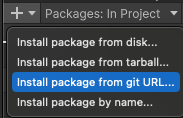

Unity Easy Gui Editor
===

Easier creation of hierarchical debug menus

About Unity Easy Gui Editor
---
Unity Easy Gui Editor makes menu creation in GUILayout very easy.

First create a GuiEditor component; you can easily register a hierarchical menu from GuiEditor.AddEntry.

The menu will automatically scale for the screen resolution.


Usage
--- 

```
using UnityEasyGuiEditor;

GuiEditor.OnGui += "PATH/TO/USE", entry =>
{
    // OnGUI
};

````

Created entries can also be displayed as an EditorWindow.

[Window] -> [GUI Editor]


UPM
--- 
**https://github.com/yassy0413/UnityEasyGuiEditor.git**

You can install from Package Manager.




